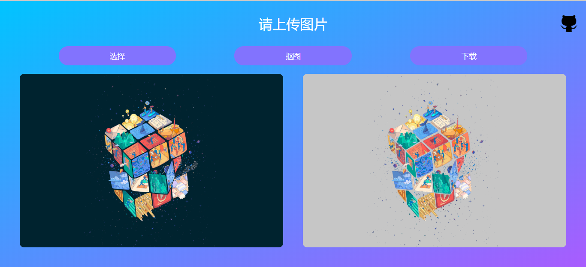
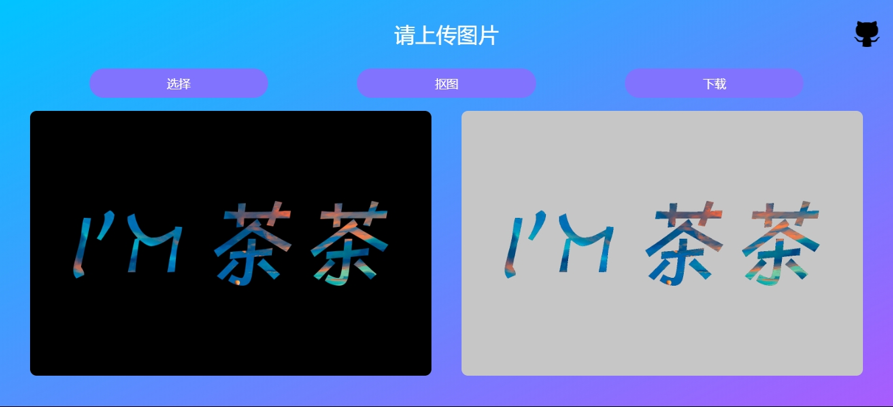
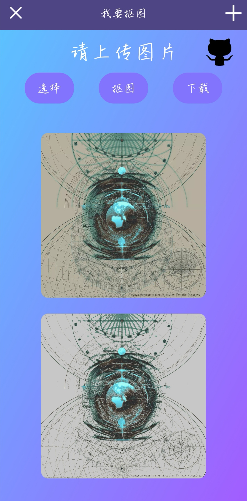
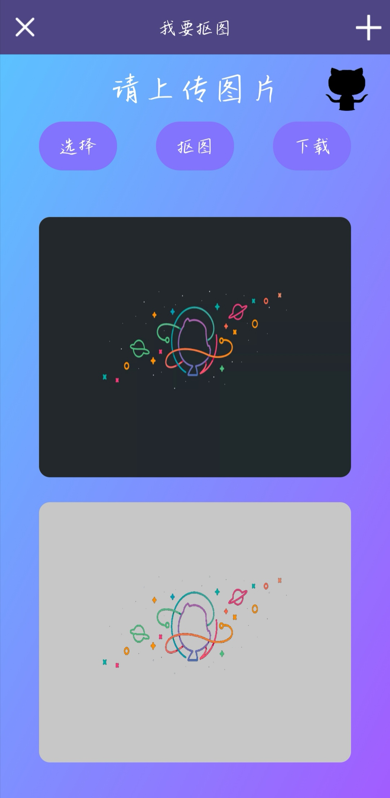

# matting-in-Frontend【前端抠图】

体验网址： [我要抠图](http://bingchacha.top/matting/)

---

>由来

这个项目的由来是因为着急着需要处理百余张图片，把里面的字抠出来，而这些图片有一个特点，那就是白纸黑字，也不都是白纸黑字，反正意思就是`背景和前景分明`，而我需要做到的就是把前景给抠出来。

>PS?

你可能会问我为什么不用PS，虽然PS抠图功能强大，但是抠几百张图片确实还是会要半条小命的，看网上的介绍，PS中的确有批量抠图的设置，但是其局限性太大，完全不适合这些颜色、大小、方位都不一样的字体。

确实，PS抠图的灵魂毕竟还是进行了人工干预，即使简单如快速选择工具也至少需要你点击一下，而懒散如我是点击一下都不想要的，加之任务时间紧急，我干脆就写程序来抠图好了。

>关于批量抠图

批量抠图的代码我还没放上来，到时候等画好合适的UI再传吧

其实有了单幅图像的抠图代码稍微改改就很好完成多张图的批处理的，我这边当时抠图的速度确实一度达到 `近100张图/min`

>Continue...

关于这个最初版本的小demo其实不难，主要用到的就是canvas处理，其实不管你用其他的比如OpenCV等什么技术，核心都是对像素进行处理。但抠图理论不光是 `C = α*f + (1-α)*b` 这个公式的事，很多时候同样需要适合的算法。

关于前端抠图，不论是`批量化处理`，还是其他的拓展，比如`选色/取色抠图、滤镜风格、二值化灰度处理、图片风格化`等，都是一件好玩甚至可能有用的事，所以也挺希望可以趁有空的时候再拓展一下其他的小功能，敬请期待噢~

>效果

